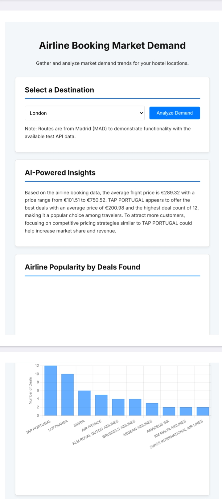
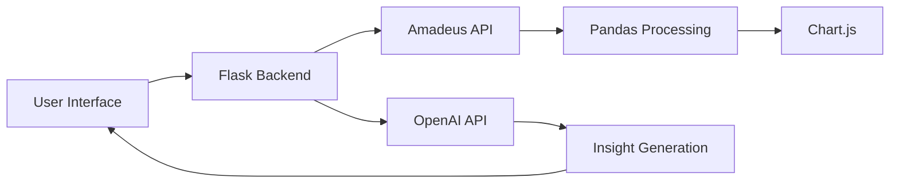

# ✈️ Airline Market Demand Dashboard

[](https://python.org)
[](https://flask.palletsprojects.com)
[](https://openai.com)
[](https://developers.amadeus.com)

A Python web application developed for the Python Developer Intern assessment with PS Fin Solutions. This tool helps a chain of Australian hostels analyze airline booking trends to make data-driven decisions on marketing, pricing, and staffing.

**Live Demo:** [will be update soon.]  

---

## 📖 The Story: From Business Problem to Solution
### **Chapter 1: Understanding the Core Need**
The goal was clear: transform raw, publicly available flight data into simple, actionable insights. A web application was the perfect solution, as it required no coding knowledge from the end-user. The key was to build a tool that was not just functional, but also intuitive and fast.

### **Chapter 2: The Problem-Solving Approach**
Given the constraints (1 day, no budget), I adopted a pragmatic approach:
1. **Data Source - API over Scraping**: Used **Amadeus developer API** for data reliability and stability
2. **Handling Real-World Challenges**: Pivoted to Madrid routes when Australian data was unavailable
3. **Insight Generation**: Integrated **OpenAI API** for human-readable summaries

### **Chapter 3: The Result - Functional & User-Friendly Tool**
<div align="center">
  <a href="static/images/Airline Market Demand Dashboard.pdf" target="_blank">
    
    <br>
    <em>View Full Dashboard Output (PDF)</em>
  </a>
</div>

---

## 🔑 Key Features & Evaluation Criteria
| Feature | Implementation Status |
|---------|----------------------|
| **Data Collection** | ✅ Amadeus API integration |
| **AI Insights** | ✅ OpenAI API summarization |
| **Web Interface** | ✅ Flask + HTML + JavaScript |
| **Data Processing** | ✅ Pandas aggregation |
| **Visualization** | ✅ Chart.js interactive graphs |
| **Security** | ✅ Environment variables |

---

## ⚙️ Technical Architecture


---

## 🚀 Setup & Installation

### 1. Prerequisites
- Python 3.9+
- Git client

### 2. Clone Repository
```bash
git clone [Your-GitHub-Repo-Link-Here]
cd airline-demand-app
```

### 3. Virtual Environment
```bash
python -m venv venv
# Windows: venv\Scripts\activate
# macOS/Linux: source venv/bin/activate
```

### 4. Install Dependencies
```bash
pip install -r requirements.txt
```

### 5. Configure API Keys
Create `.env` file:
```env
AMADEUS_API_KEY="YOUR_KEY"
AMADEUS_API_SECRET="YOUR_SECRET"
OPENAI_API_KEY="YOUR_OPENAI_KEY"
```

### 6. Launch Application
```bash
flask run
```
Visit `http://127.0.0.1:5000` in your browser

---

```
